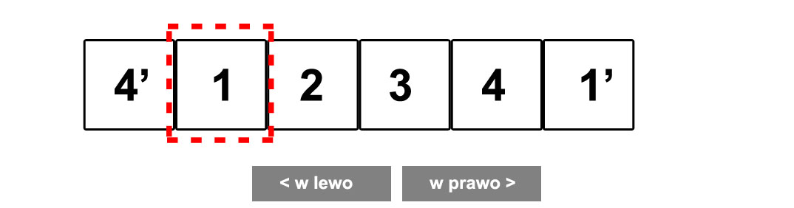
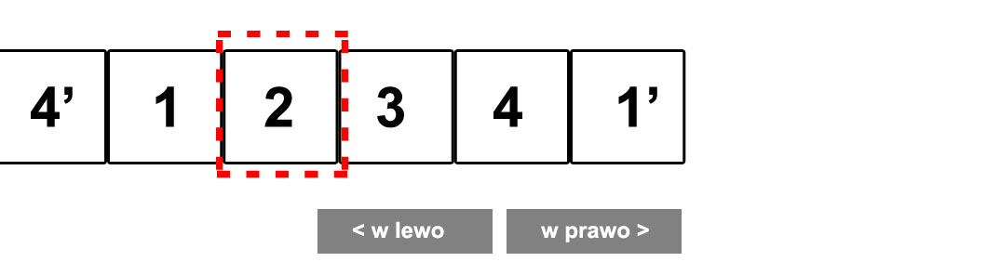
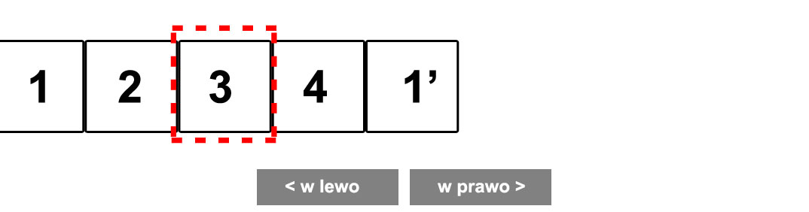
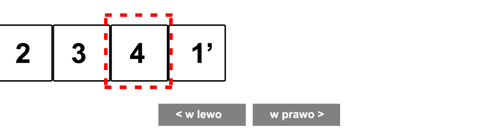
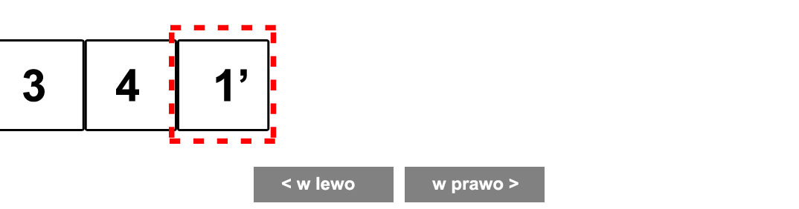

# jQuery &ndash; exercise
# InfiniteSlider

Write a slider that moves slides indefinitely, which means that after the last image, the first one will be displayed again. Write a simple slider. The task is divided into sections. Stick to the instructions and do them one by one.
Remember to make a commit when you have finished the exercise.

## 1
Study the HTML code for this exercise. To create a slider, we usually style a list that stores images. If you have done the previous exercise, just copy part of the HTML code. Add ```slider``` **class** to an appropriate HTML element.

## 2
Prepare the JavaScript file so that you can work in it. Add an event that will check if DOM elements are loaded (remember that the exercise should be done in jQuery). Check if it works properly (e.g. by displaying the message "It works" in the console).

Create a function responsible for the entire gallery animation. Remember about appropriate comments and an appropriate name for the function.

In the function that you have written, find the following elements and save them in variables (same as in the previous exercise):

1. `Next` button.
2. `Prev` button.
3. All list elements (save them in an array).
4. Add a numeric variable that will determine the index of the visible image (At first, it will be the first image &ndash; the variable will point to **0** index).
5. Add another variable that will store the width of a single image.

Check if you have found the right elements and if their number is correct. Display the variables in the console to ensure that they contain correct data.

## 3
Create variables where you will store cloned first and last element of the list, and immediately append them to the list:
* clone the first element and place it at the end of the list,
* clone the last element and place it at the beginning of the list.

### Why do we clone those elements?

Imagine that you have a slider consisting of four pictures. Look carefully at the images below.

1. Starting position:

  

2. When the ```Next``` button is clicked, the whole container is moved by the width of the image:

  

3. When the ```Next``` the whole container is moved by the width of the image:

  

4. When the ```Next``` the whole container is moved by the width of the image:

  

4. When the ```Next``` the whole container is moved to the cloned first element and an unnoticeable return to the first element.

  
  

## 4
Let's get back to our code.
In a function, set the width of the **ul** container based on the data stored in your variables, so that all images fit side by side (remember to remove the container width from the CSS file).

## 5
Add a mouse click event to the ```Next``` button (do not use loops &ndash; you are working in jQuery). For now, the event should display any text in the console.

## 6
Modify the event so that, after the button is clicked, it:

1. Increases the value of the variable that stores image index.
2. Use the ```animate``` function in a way that you not only move the **ul** container, but also automatically move the slider to the first image (**if** statement) - if you are positioned on the last image . To do this, use the ```complete``` function in ```animate``` (if you do not know how to use it, check the documentation). In other words, move to the first element when the animation fas finished.

## 7
Add another event for the `Prev` button. Follow the same steps as for the `Next` event. Just remember about the following conditions:
* variable specifying the image index in the other direction,
* movement direction.
You should still use the ```left``` property. Use the ```complete``` function.

## 8
Try to move the code from the event to a function.
Think about what parameters you should pass to the function. Set an appropriate name for it and a comment.

## 9
Check how your site works. Can you see any problems? If so, describe them in a comment.
